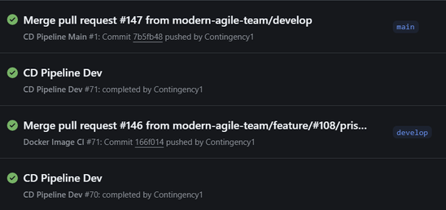
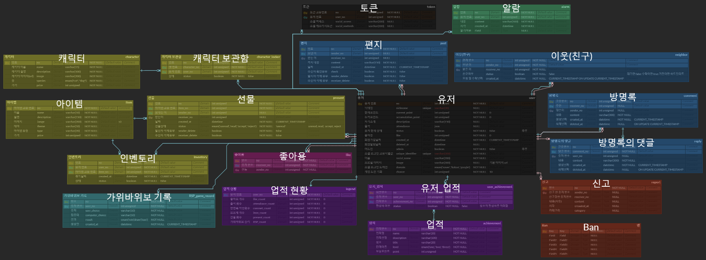
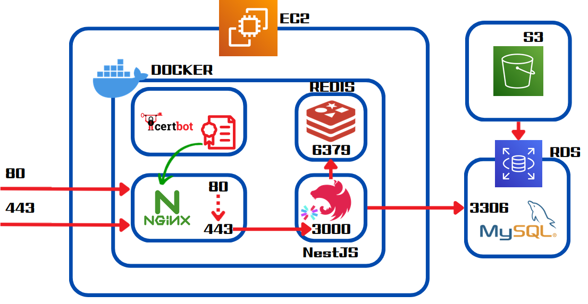
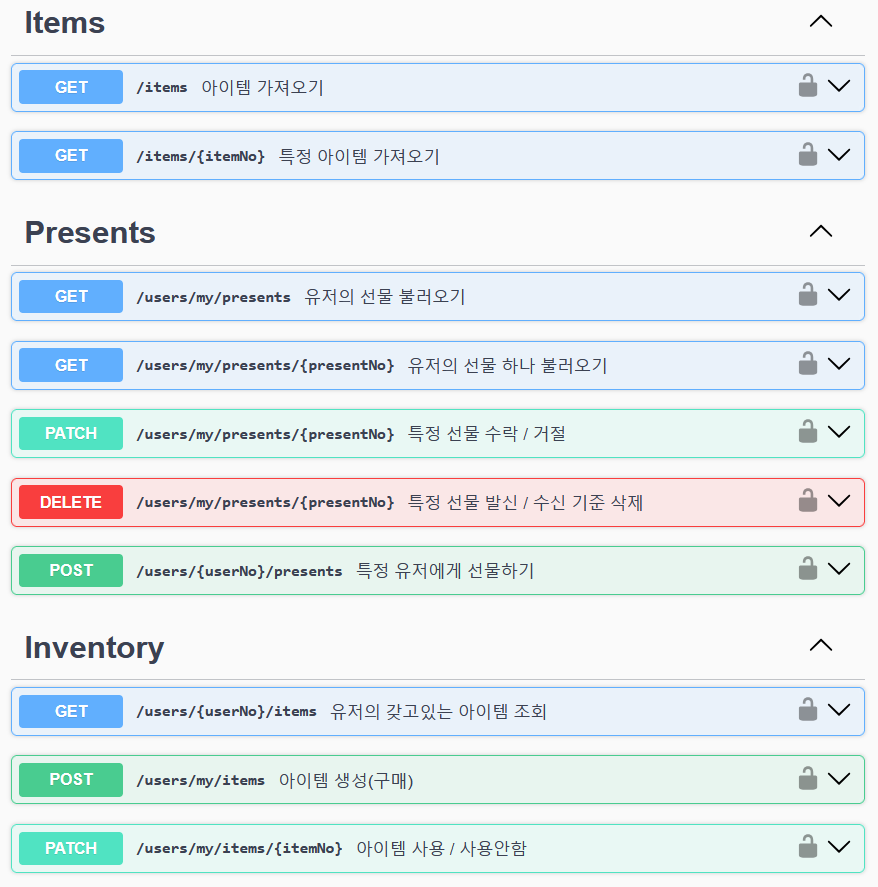
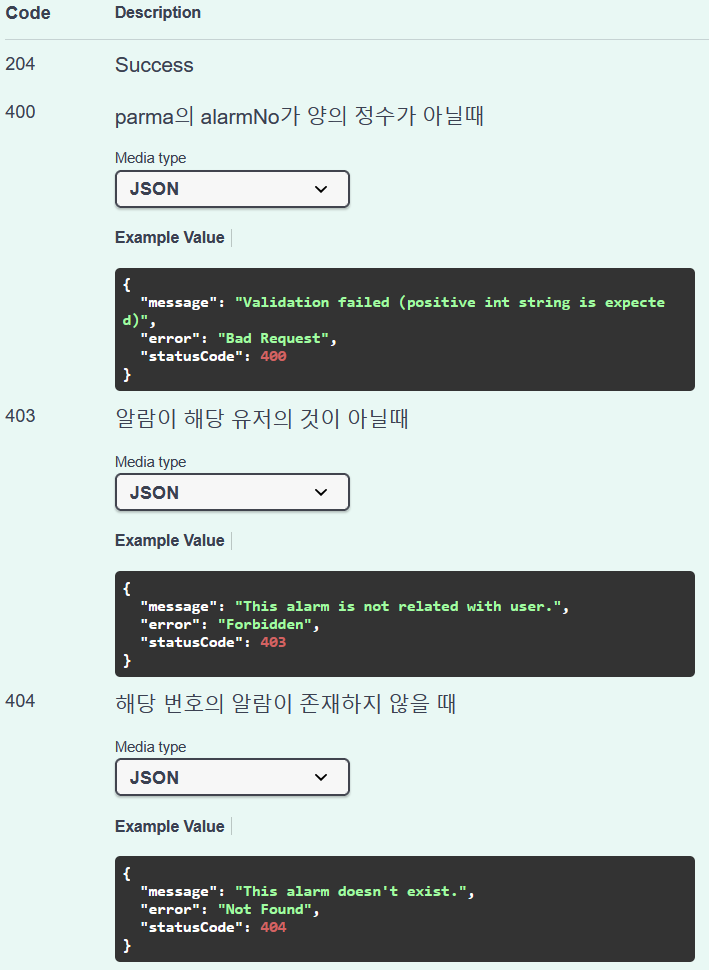

# 🌍 Modern World (Back-End)

#### [모던월드 바로가기](https://modern-world.kr)

> _(현재 Java/Spring Boot + DDD 구조로 리팩토링 및 마이그레이션이 완료되어 서비스 중입니다.)_

<br>

> **Modern Agile 7기 메인 프로젝트**
> 나만의 캐릭터와 공간을 꾸미고, 이웃과 소통하며 즐기는 **웹 커뮤니티 & 미니게임 서비스**

<div align="left">
  
  
  
  
  
</div>

---

## ✨ 주요 기능

프로젝트는 모듈 단위로 구성되어 있으며, 주요 기능은 다음과 같습니다.

- **🔐 인증 및 인가 (Auth)**
  - JWT 기반 자체 로그인 및 소셜 로그인(Google, Kakao, Naver) 지원
  - Redis를 활용한 Refresh Token 관리
- **🏠 커뮤니티 & 소셜 (Community)**
  - 게시글(Post), 댓글/대댓글(Comment/Reply), 좋아요(Like) 기능
  - 이웃 맺기(Neighbor), 선물하기(Present) 시스템
- **🎮 게임 과 성장, 아이템 (Game & Growth & asset)**
  - 가위바위보 미니게임 (Rock-Scissors-Paper)
  - 업적(Achievements), 유저 기록(Legends), 인벤토리(Inventory) 및 아이템 시스템
  - 캐릭터 설정(Character Locker)
- **🔔 실시간 알림 (Notification)**
  - Server-Sent Events (SSE)를 이용한 실시간 사용자 알림 전송

---

## 🏗 아키텍처 및 회고

### ⚠️ 기존 아키텍처의 한계

이 프로젝트는 **NestJS + Prisma**를 기반으로 **Layered Architecture**로 구축되었습니다. 초기 개발 속도는 빨랐으나, 다음과 같은 구조적 한계를 확인했습니다.

1.  **높은 결합도**: 비즈니스 로직이 Prisma ORM에 강하게 의존하여, DB 계층의 변화가 서비스 계층에 직접적인 영향을 미치고 구현체를 직접 주입받아 ORM 변경시 상당한 비용 발생 예상.
2.  **응집도 저하**: 도메인 로직이 서비스 레이어에 산재되어 있어 유지보수성과 테스트 용이성이 떨어짐.
3.  **이벤트 기반 설계의 부재**: 도메인 상태 변화(예: Legend 갱신)에 따른 후속 작업(예: 업적 달성)을 이벤트가 아닌 서비스 간 직접 호출로 처리하여, 비즈니스 로직 간의 의존성이 복잡해짐.

---

### 🚀 개선 및 마이그레이션

위 문제를 해결하기 위해 현재 **Java Spring Boot + JPA** 환경으로 마이그레이션을 진행했으며, **DDD(Domain-Driven Design)** 패턴을 도입하여 도메인 중심의 설계를 적용했습니다.

👉 [Migration Project Repository (ModernWorldV2)](https://github.com/Contingency1/ModernWorldV2)

---

## 💻 실행 명령어 (Commands)

`package.json`에 정의된 주요 스크립트는 다음과 같습니다.

| Command                | Description                     |
| :--------------------- | :------------------------------ |
| `npm run start:dev`    | 개발 모드 실행 (Watch Mode)     |
| `npm run start:docker` | 배포(docker) 모드 실행 (Docker) |
| `npm run build`        | 프로젝트 빌드 (Build)           |

> **Prisma Setup**
>
> ```bash
> $ npx prisma generate  # Prisma Client 생성
> $ npx prisma db push   # DB 스키마 동기화
> ```

---

## 🔄 CICD 자동화

**GitHub Actions**와 **Docker**를 활용하여 빌드 및 배포 자동화 파이프라인을 구축했습니다.


---

## 🛠 ERD



---

## 📡 Server flow



---

## 📚 문서화

|                Swagger UI                |               API Example                |
| :--------------------------------------: | :--------------------------------------: |
|  |  |

---

## 🛠 기술 스택 (Tech Stack)

| Category          | Stacks                                        |
| ----------------- | --------------------------------------------- |
| **Framework**     | NestJS                                        |
| **Language**      | TypeScript                                    |
| **Database**      | MySQL, Redis                                  |
| **ORM**           | Prisma                                        |
| **Auth**          | Passport, JWT                                 |
| **Documentation** | Swagger                                       |
| **Infra & Etc**   | AWS, Docker, Winston(Logging), SSE(Real-time) |

---

### <span style='background-color:#ffdce0'> BACK - END </span>

#### 김준우 | Jun-woo, Kim

<a href="https://github.com/cyoure">

</a>

#### 안진우 | Jin-woo, Ahn

<a href="https://github.com/jinwoo0207">

</a>

#### 조영은 | Young-eun, Jo

<a href="https://github.com/Contingency1">

</a>

### <span style='background-color:#ffdce0'> FRONT - END </span>

#### 김은우 | Eun-woo, Kim

<a href="https://github.com/dmsdnWkd1234">

</a>

#### 김진 | Jin, Kim

<a href="https://github.com/chamjin">

</a>

---

## Branch Strategy

**이슈 생성 시 `Assignees`, `Labels`, `Project` 꼭 할당**

### Default Branch

| Name | Description                    |
| ---- | ------------------------------ |
| main | repository default branch      |
| dev  | development environment branch |

### Branch Example

- feature/#issueNo/title

예시

- feature/#10/create_user_board

## Commit Convention

### Commit Example

**{type}/#{issue-number}: 작업한 사항(띄어쓰기 허용)**

예시

- setting/#3: project set up

### Commit Type

| Type     | Description                          |
| -------- | ------------------------------------ |
| bugfix   | 버그 수정                            |
| db       | 데이터베이스 관련 작업               |
| delete   | 코드 삭제                            |
| doc      | 문서 작업                            |
| feature  | 새로운 기능 추가                     |
| modify   | 코드 수정(기능상의 수정이 있는 경우) |
| refactor | 코드 수정(기능상의 수정이 없는 경우) |
| test     | 테스트코드 관련 작업                 |
| deploy   | 배포 관련 작업                       |
| setting  | 세팅 관련 작업                       |
